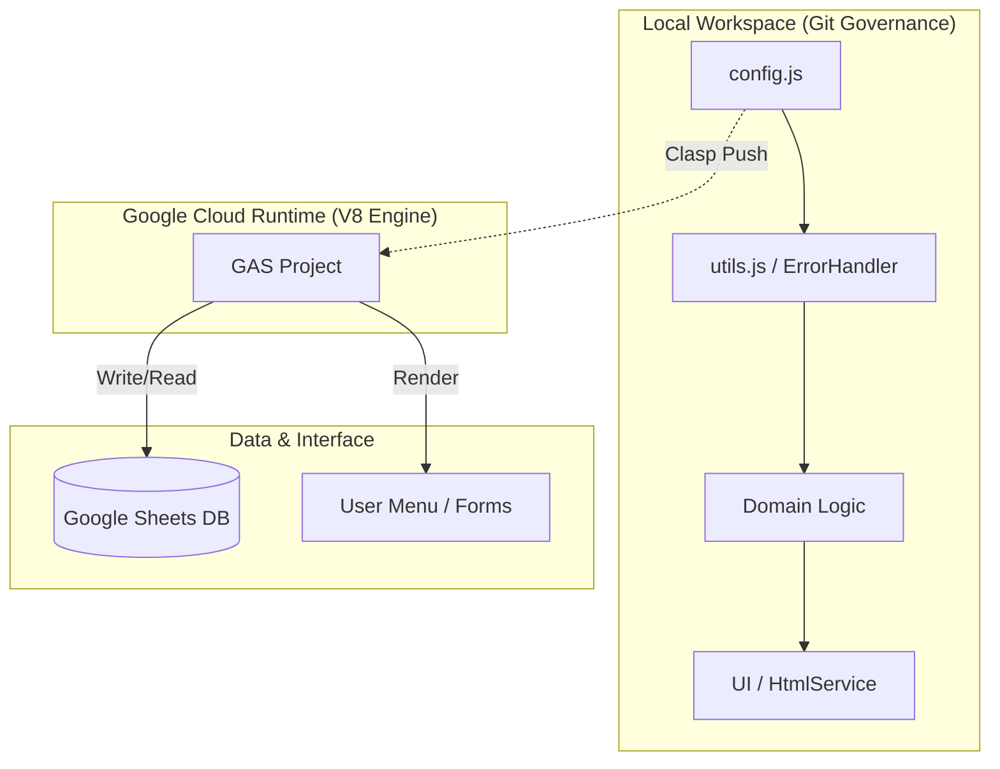

# 🧬 Google Apps Script Ecosystem — CCBEU Enterprise Suite

## 🚀 Vision & Identity
This ecosystem represents a **High-Performance Engineering Lab** centralized in `AppScript`. It is not just a collection of scripts, but a modular suite of **Digital Assets** designed to automate mission-critical business processes at CCBEU with enterprise-grade reliability, security, and scalability.

---

## 🏗️ System Architecture & Blueprint

The architecture follows a **Decoupled Strategic Design**, ensuring that business rules are independent of the spreadsheet infrastructure.

### 🏛️ Engineering Pillars
1.  **Clean Architecture:** Domain logic is isolated from global triggers and UI specificities.
2.  **Defensive Programming:** Mandatory use of **Guard Clauses** and centralized **Exception Management**.
3.  **State Management:** Absolute path toward immutability using `Object.freeze()` for environmental schemas.
4.  **Operational Excellence:** Automated `onEdit` triggers optimized for O(1) or O(log n) lookups using Hash Maps.

---

## 🚀 Portfolio of Assets

| Project | Vertical | Architecture Pattern | Deployment Status |
| :--- | :--- | :--- | :--- |
| [**Leads_CCBEU_Vendas**](./Leads_CCBEU_Vendas) | Sales Ops | Modular Registry + Balanced Distribution | `PROD v3.1` |
| [**Controle_de_Receptiva**](./Controle_de_Receptiva) | Customer Exp | Business Rule Formatting + Holiday Engine | `STABLE v2.0` |
| [**Controle_de_Atendimentos**](./Controle_de_Atendimentos) | Analytics | Real-time Dashboarding + Resilient Write-layer | `PROD v2.0` |
| [**Verificao_de_Duplicidade**](./Verificao_de_Duplicidade) | Data Quality | Event-driven High-speed Verification | `PROD v1.5` |

---

## ⚙️ Standardized Senior Patterns

### 🛡️ Resilience: `ErrorHandler` Logic
Instead of fragmented `try-catch` blocks, we use a centralized invoker that standardizes error logging and UI feedback.
- **Fail-Safe:** Operations that require the UI context wrap themselves in a fallback mode to prevent trigger failures in headless executions.
- **Audition:** Every failure is mapped with a unique context ID for easier debugging in the GAS Stackdriver logs.

### ⚡ Performance Mapping (Big-O)
- **Batch Operations:** Direct use of `Range.getValues()` and `Range.setValues()` to avoid the N+1 API call bottleneck.
- **Memory Consumption:** Strategy of filtering data in-memory before commitment to the spreadsheet layer.

---

## 💻 Developer Experience (DX) & Workflow

### 🔧 Local Development Protoccol
To maintain **Git Governance**, we use [Google Clasp](https://github.com/google/clasp).
1.  `clasp clone <SCRIPT_ID>` — Pull current state.
2.  **Development** — Edit locally using VS Code and standard JS/TS tooling.
3.  `clasp push` — Deploy to the Apps Script environment.
4.  `clasp version "vX.X"` — Tag a production release.

### 📜 Coding Standards
- **Naming:** CamelCase for functions and variables; SCREAMING_SNAKE_CASE for frozen constants.
- **Documentation:** Every function must include JSDoc with `@param`, `@return`, and `@throws` definitions.
- **Linting:** Zero-tolerance for unused variables or implicit global assignments.

---

## 🗺️ Roadmap & Evolution (Technical Debt)
- [ ] **TypeScript Migration:** Transitioning all `.js` files to `.ts` for compile-time safety via Clasp.
- [ ] **Unit Testing Layer:** Implementing `GasTap` or a local testing runner for domain logic.
- [ ] **Webhook Integration:** Connecting attendance logs directly to a central n8n orchestrator.
- [ ] **Identity Management:** Implementing more granular role-based access control (RBAC) in `permissoes.js`.

---
**Lead Architect:** [HenriqueMC17](https://github.com/HenriqueMC17)
**Status:** `Active Maintenance — State of the Art`
